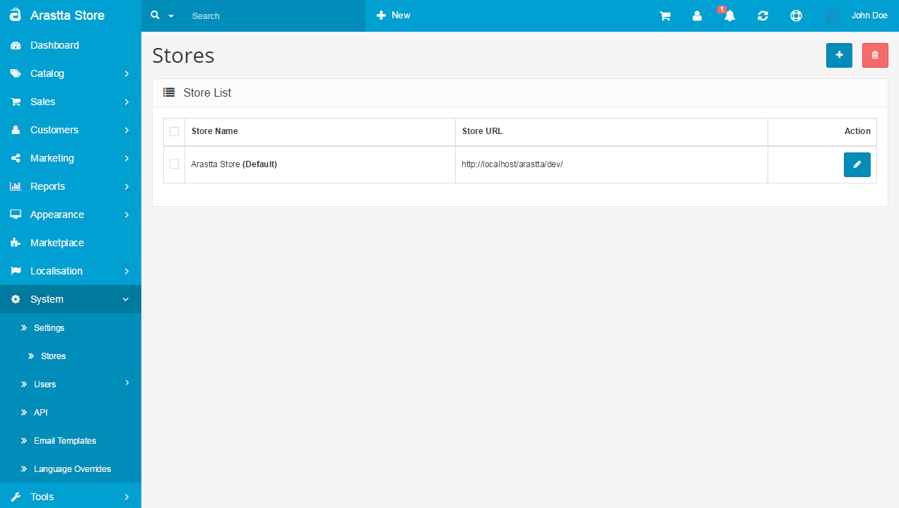

Stores
======

Arastta allows for multi-store management using only one installation. With Multi-Store, you can launch hundreds of online stores using a single integrated system. You can create unique online stores for multiple brands, product sets, B2B, B2C, affiliates, franchises, employee stores, co-branded stores and more. You can also quickly launch micro-stores for promotional campaigns. Best of all, every online store shares a single database.

Here you can get info [how to build a multi-store](docs/how-to/how-to-build-a-multi-store).

This page allow you store owners to see the list of stores and manage them one by one.

