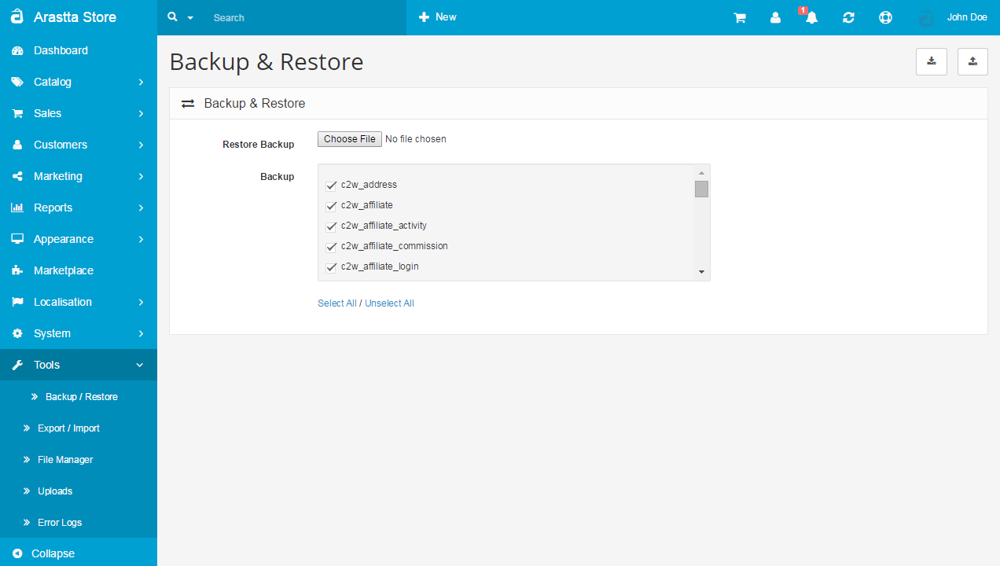

Backup / Restore
================

Backup and restore
------------------

One of the most devastating events that can happen to an online store is the loss of a database. The store database contains important customer and product information. It is difficult for a store to recover after losing a database, and certainly takes up too much time to re-enter this necessary information. You need to be vigilant with downloading updated backups of the store's database to their computer, just in case something happens.

Arastta lets you download a backup of the store's current database or restore the database to the administration in System>Backup/Restore. The Backup section seen below contains all the data tables in the MySQL database available for download. You can choose what files you want to download by checking on them. Clicking the "Backup" button will download the selected tables to your computer.

If you need to restore a backup file that you previously saved to your computer, all you need to do is click "Choose File" from Restore Backup, select the sql file from their computer, and the database will be restored.

