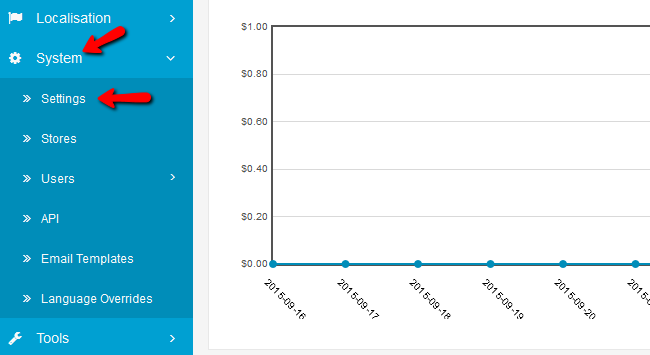
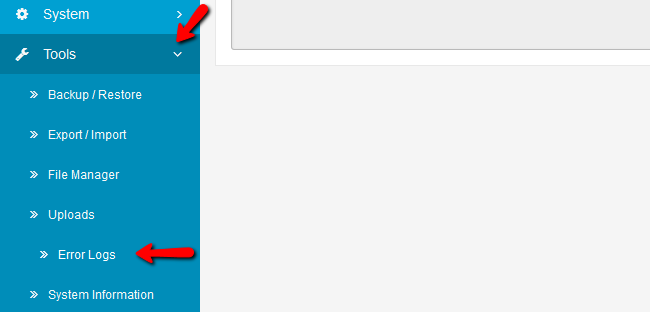
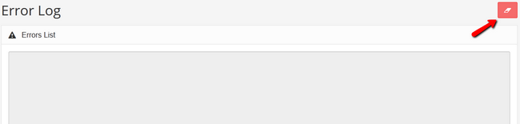
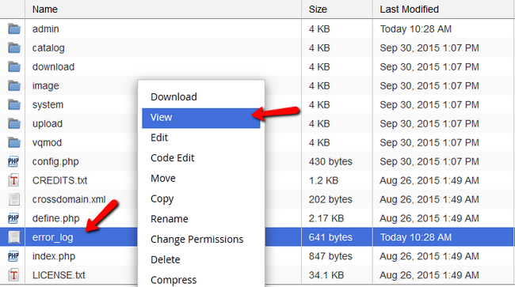

Error Logs
==========

How to Find and Configure the Error Log in Arastta?
----------------

The error log is very useful when trying to determine bugs or incomplete code on your website. In Arastta there is a build-in error log system that will allow you to see any errors a user has experienced while browsing your store. In the case of a problem with the PHP modules another error log is created inside your Arastta folder on the server. You can check it via SSH/File Manager when you cannot access the website itself.

To find,view and clean the Error Log, you need to complete the following steps:

###STEP 1: Configuring the Error Log

To configure the Error Log you will need to access the System>Settings section of the main admin menu.

Select the **Server** tab and scroll down to the bottom of the page for the error log options.

Of course you will not want to display any errors while your store is live as that means your customers will also be able to see them. To enable the logging of errors select **Yes** in the **Log Errors** configuration. You will also be able to set a custom name for the Error Log file. This log file is situated in System/log/error.log

###STEP 2:  Accessing the Error log in Arastta

To access the build-in error log you must be logged in your Arastta admin dashboard and then navigate to **Tools>Error Logs**.

You will not be able to edit anything in the Error List but if you have a big error log it is recommended to clean it after you have resolved the issues in it.

You can do that by clicking the Clear button.

###STEP 3:  How to troubleshoot PHP modules via error_log

Let us say that you have enabled Memcache by mistake via the caching settings inside Arastta, you have Memcached installed but the PHP module is disabled in your PHP version configuration. This will result in a blank page on your store and admin area and if you are not aware what the cause is you might think the only way to fix it is to create a new store. In these cases the auto created **error_log** is very valuable.
 
error_log is created in your main Arastta folder and can be opened with the help of cPanel’s File Manager.

You can also open the log via SSH by navigating to the main Arastta folder and using the command:
 
**tail error_log**

Here is what we get from the error_log:

    [02-Oct-2015 13:09:35 UTC] PHP Fatal error:  Uncaught exception 'RuntimeException' with message 'Memcached not supported.' in /home/user/public_html/arastta/system/vendor/joomla/cache/src/Memcached.php:36
    Stack trace:
    #0 /home /user/public_html/arastta/system/library/cache.php(22): Joomla\Cache\Memcached->__construct(Array)
    #1 /home/user/ public_html/arastta/system/library/app/catalog.php(93): Cache->__construct('memcached', '86400')
    #2 /home/user/public_html/arastta/index.php(27): Catalog->initialise()
    #3 {main}
    thrown in /home/user/public_html/arastta/system/vendor/joomla/cache/src/Memcached.php on line 36
    
From this we can clearly see that Memcached is not supported as a PHP module. If you go into **cPanel>Select PHP Version**, enable memcache/memcached and click **Save** the website will start working properly again.
