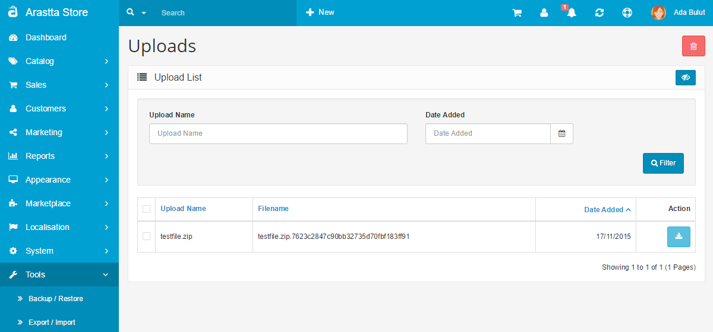

Uploads
=======

Basically, this is the list of all uploaded files from customers. These files are uploaded from the "File" field of products [options](docs/user-manual/catalog/options) or customers' account/address pages. The second is called "[Custom Fields](docs/user-manual/customers/fields)".

It allows store owners to download or delete the files. The search field helps to find the file and the date field helps to filter files according the uploaded date.

